<p align="center">
  
  
  
</p>

<h1 align="center">Firstbrain</h1>

<p align="center">
  <strong>AI-Native Second Brain &amp; Execution Engine</strong><br/>
  <em>You think. Claude organizes, codes, and ships.</em>
</p>

<p align="center">
  <a href="https://github.com/BEKO2210/Firstbrain/releases"></a>
  <a href="LICENSE"></a>
  <a href="https://github.com/BEKO2210/Firstbrain/stargazers"></a>
  <a href="https://github.com/BEKO2210/Firstbrain/issues"></a>
  
</p>

<p align="center">
  <a href="#features">Features</a> &bull;
  <a href="#quick-start">Quick Start</a> &bull;
  <a href="#execution-engine">Execution Engine</a> &bull;
  <a href="#skills">Skills</a> &bull;
  <a href="#architecture">Architecture</a> &bull;
  <a href="#governance">Governance</a> &bull;
  <a href="#memory-system">Memory</a>
</p>

---

## What is Firstbrain?

Firstbrain turns an Obsidian vault into an **AI command center**. Claude Code doesn't just organize your notes -- it **executes your instructions**: writing code, creating projects, pushing to GitHub, and documenting everything as interconnected markdown.

**Without Claude Code** -- a structured Obsidian starter vault (PARA folders, 12 templates, 9 MOCs).

**With Claude Code** -- a second brain that thinks, builds, and ships for you.

---

## Features

<p align="center">
  
</p>

---

## Quick Start

### One-Click Launcher

Double-click to start. The launcher checks Node.js, Claude Code CLI, validates the vault, and launches:

<p align="center">
  <code>start.sh</code> (Linux/macOS) &nbsp;&bull;&nbsp; <code>start.bat</code> (Windows) &nbsp;&bull;&nbsp; <code>start.command</code> (macOS Finder)
</p>

### Manual Setup

<p align="center">
  
</p>

---

## Execution Engine

<p align="center">
  
</p>

---

## Skills

<p align="center">
  
</p>

---

## Architecture

### Vault Structure

<p align="center">
  
</p>

### Scanning Pipeline

<p align="center">
  
</p>

---

## Governance

<p align="center">
  
</p>

---

## Memory System

<p align="center">
  
</p>

---

## Roadmap

- [x] **v1.0** -- Foundation, scanning, 7 core skills, semantic search, 4-layer memory *(2026-03-07)*
- [x] **v1.1** -- Proactive Intelligence: `/briefing`, `/triage`, `/synthesize`, `/maintain` *(2026-03-08)*
- [x] **v2.0** -- Execution Engine, `/process`, `/watch`, `workspace/`, `ACTION:`/`TASK:` markers, guided onboarding, prompt injection defense *(2026-04-07)*
- [x] **v3.0** -- Knowledge Graph Engine, `/graph` (PageRank, clusters, bridges, paths), `/propose` (emergent structure), `/connect` v3 (multi-hop + structural similarity) *(2026-04-07)*
- [ ] **v4.0** -- Temporal analysis, automated weekly digests, cross-vault federation

---

## Contributing

Ideas, bugs, or new templates? See [CONTRIBUTING.md](CONTRIBUTING.md).

```bash
git clone https://github.com/YOUR_USERNAME/Firstbrain.git
cd Firstbrain && git checkout -b feature/my-feature
# Make changes, then:
git commit -m "feat: add my feature" && git push origin feature/my-feature
```

---

## License

[CC BY-NC 4.0](LICENSE) -- Free for personal and non-commercial use. For commercial licensing, [contact the author](https://github.com/BEKO2210).

---

<p align="center">
  <sub>Built with Obsidian + Claude Code</sub>
</p>
