<p align="center">
  
  
  
</p>

<h1 align="center">Firstbrain</h1>

<p align="center">
  <strong>AI-Native Second Brain for Obsidian</strong><br/>
  <em>Claude thinks. You create.</em>
</p>

<p align="center">
  <a href="https://github.com/BEKO2210/Firstbrain/releases"></a>
  <a href="LICENSE"></a>
  <a href="https://github.com/BEKO2210/Firstbrain/stargazers"></a>
  <a href="https://github.com/BEKO2210/Firstbrain/issues"></a>
  
</p>

<p align="center">
  <a href="#quick-start">Quick Start</a> &bull;
  <a href="#skills">Skills</a> &bull;
  <a href="#architecture">Architecture</a> &bull;
  <a href="#templates">Templates</a> &bull;
  <a href="#memory-system">Memory</a> &bull;
  <a href="#contributing">Contributing</a>
</p>

---

## What is Firstbrain?

Firstbrain transforms a plain Obsidian vault into an **AI-native knowledge management system**. Claude Code acts as the cognitive layer — scanning your vault, creating notes from templates, discovering connections, searching by meaning, triaging your inbox, processing prompt-driven workflows, synthesizing knowledge, and maintaining consistency — all while remembering your context across sessions.

**Without Claude Code**, it's a beautifully structured Obsidian starter vault with PARA folders, 12 templates, and 8 Maps of Content.

**With Claude Code**, it becomes a second brain that actively works for you.

```
"Create a tool note about Docker"       → Claude picks the template, fills metadata, suggests links
"What did I write about productivity?"   → Semantic search finds notes by meaning, not keywords
"Triage my inbox"                        → Classifies notes, suggests folders, auto-tags high-confidence items
"Give me a briefing"                     → Calm daily summary of changes, priorities, and suggestions
/process                                 → Executes PROMPT: files from Inbox, creates full project structures
```

---

## Features

<p align="center">
  
</p>

---

## Quick Start

<p align="center">
  
</p>

---

## Skills

<p align="center">
  
</p>

---

## Architecture

### Vault Structure

```
Firstbrain/
├── 00 - Inbox/              Landing zone for new notes and daily notes
├── 01 - Projects/            Active projects (time-bound, has end date)
├── 02 - Areas/               Life areas (ongoing, no end date)
├── 03 - Resources/           Knowledge, references, learning material
├── 04 - Archive/             Completed or inactive items
├── 05 - Templates/           12 note templates (read-only)
├── 06 - Atlas/MOCs/          9 Maps of Content (navigation hubs)
├── 07 - Extras/              Attachments, Kanban boards, media
├── .agents/skills/           Claude Code skill definitions + utilities
│   ├── briefing/             Daily executive summary
│   ├── connect/              Connection discovery engine
│   ├── create/               Template-based note creation
│   ├── daily/                Daily note with task rollover
│   ├── health/               Orphan + broken link detection
│   ├── maintain/             Vault consistency auditing
│   ├── memory/               Four-layer memory management
│   ├── process/              Command Processor (prompt execution)
│   ├── scan/                 Incremental vault scanner + indexer
│   ├── search/               Semantic + keyword search
│   ├── synthesize/           Topic-based knowledge synthesis
│   └── triage/               Inbox classification and filing
├── .claude/                  AI system config, rules, memory
│   ├── memory/               Working memory + insights + project state
│   └── rules/                Governance rules (naming, linking, frontmatter)
├── CLAUDE.md                 AI-native instructions (loaded on startup)
├── Home.md                   Central dashboard
├── START HERE.md             User onboarding guide
└── Workflow Guide.md         Daily workflow instructions
```

### Scanning Pipeline

<p align="center">
  
</p>

### Zero-Dependency Core

The scanning engine, parser, indexer, and all core skills use **only Node.js built-ins** — no external packages. This means:

- No `npm install` needed for core functionality
- No ESM/CJS compatibility issues
- No supply chain risk
- Fast startup (~15ms full scan, ~5ms incremental)

The only optional dependency is `@huggingface/transformers` for semantic search embeddings, loaded via dynamic `import()` with graceful degradation.

---

## Memory System

Firstbrain implements a **four-layer memory architecture** that gives Claude persistent context across sessions.

<p align="center">
  
</p>

| Layer | Persistence | Updates |
|-------|-------------|---------|
| Session | Current session only | Continuous |
| Working | `MEMORY.md` + topic files | On significant actions |
| Long-term | `insights.md` | After 10+ note changes or topic density triggers |
| Project | `project-{name}.md` | Per project interaction |

Long-term insights use **confidence scoring** (0.0-1.0) with decay. Entries below 0.3 are pruned. Only insights >= 0.5 are surfaced to the user.

---

## Governance

Claude's autonomy is governed by three zones:

| Zone | AUTO | PROPOSE | NEVER |
|------|------|---------|-------|
| **Content** | Fix broken links, fill frontmatter | — | Edit body text |
| **Structure** | Add note to MOC, fix MOC links | New folders, restructure, new MOCs | Delete folders |
| **System** | Update memory, log to changelog | Modify CLAUDE.md, rules, config | Delete system files |

**Hard boundaries (no exceptions):**
- Never delete any file
- Never merge notes
- Never change note body content without explicit request
- Never rename files without explicit approval

---

## Templates

12 templates with correct frontmatter, clean structure, and a Connections section:

| Template | Target Folder | Use Case |
|----------|---------------|----------|
| `Project` | `01 - Projects/` | Active projects with tasks and deadlines |
| `Area` | `02 - Areas/` | Life areas and ongoing responsibilities |
| `Resource` | `03 - Resources/` | Books, courses, articles, references |
| `Tool` | `03 - Resources/` | Software, services, and utilities |
| `Zettel` | `03 - Resources/` | Atomic ideas in your own words |
| `Person` | `03 - Resources/` | Contacts and network |
| `Decision` | `01 - Projects/` | Decisions with pros, cons, and outcomes |
| `Meeting` | `01 - Projects/` | Meeting notes with participants and actions |
| `Code Snippet` | `03 - Resources/` | Code with language, context, and explanation |
| `Daily Note` | `00 - Inbox/Daily Notes/` | Daily journal with task rollover |
| `Weekly Review` | `00 - Inbox/` | Weekly retrospective and planning |
| `Monthly Review` | `00 - Inbox/` | Monthly reflection and goal tracking |

---

## Recommended Plugins

| Plugin | Purpose | Required? |
|--------|---------|-----------|
| [Dataview](https://github.com/blacksmithgu/obsidian-dataview) | Automatic lists and tables on MOC pages | **Yes** |
| [Templater](https://github.com/SilentVoid13/Templater) | Advanced template variables and scripting | No |
| [Calendar](https://github.com/liamcain/obsidian-calendar-plugin) | Visual calendar for Daily Notes | No |

---

## Tech Stack

| Component | Technology | Purpose |
|-----------|-----------|---------|
| Vault | Obsidian + Markdown | Knowledge storage |
| AI Layer | Claude Code | Cognitive engine (12 skills) |
| Scanner | Node.js built-ins | File parsing + indexing |
| Embeddings | Transformers.js (optional) | Semantic vector generation |
| Vector Store | SQLite (node:sqlite) | Embedding storage + search |
| Search | Cosine similarity + keyword fallback | Note discovery |

---

## Roadmap

- [x] **v1.0 MVP** — Foundation, scanning, core skills, semantic search, memory *(shipped 2026-03-07)*
- [x] **v1.1 Proactive Intelligence** — `/briefing`, `/triage`, `/synthesize`, `/maintain` *(shipped 2026-03-08)*
- [x] **v1.2 Command Processor** — `/process` with full prompt execution, external source analysis, per-project changelogs, prompt archiving *(shipped 2026-04-06)*
- [ ] **v2.0** — Knowledge graph, emergent structure proposals, advanced connection intelligence

---

## Contributing

Ideas, bugs, or new templates? See [CONTRIBUTING.md](CONTRIBUTING.md).

```bash
# Fork → Clone → Branch → Commit → PR
git clone https://github.com/YOUR_USERNAME/Firstbrain.git
cd Firstbrain
git checkout -b feature/my-feature
# Make changes
git commit -m "feat: add my feature"
git push origin feature/my-feature
# Open PR on GitHub
```

---

## License

[CC BY-NC 4.0](LICENSE) — Free for personal and non-commercial use. For commercial licensing, [contact the author](https://github.com/BEKO2210).

---

<p align="center">
  <sub>Built with Obsidian + Claude Code</sub>
</p>
